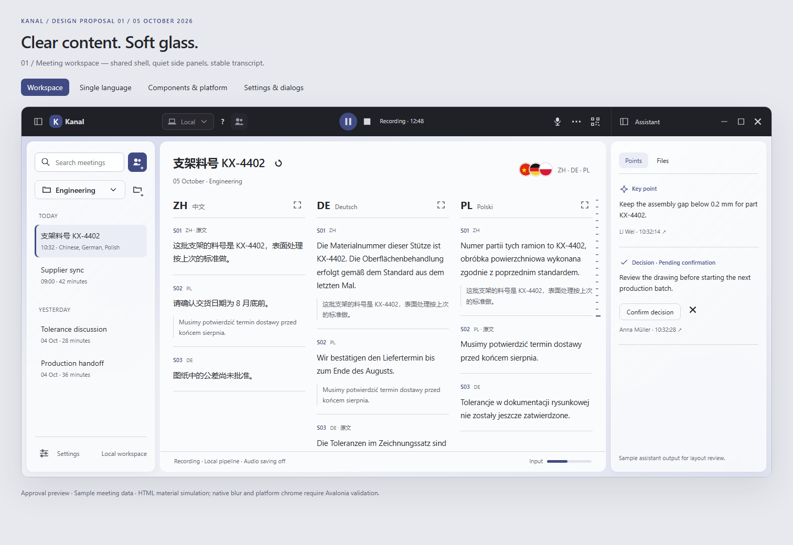
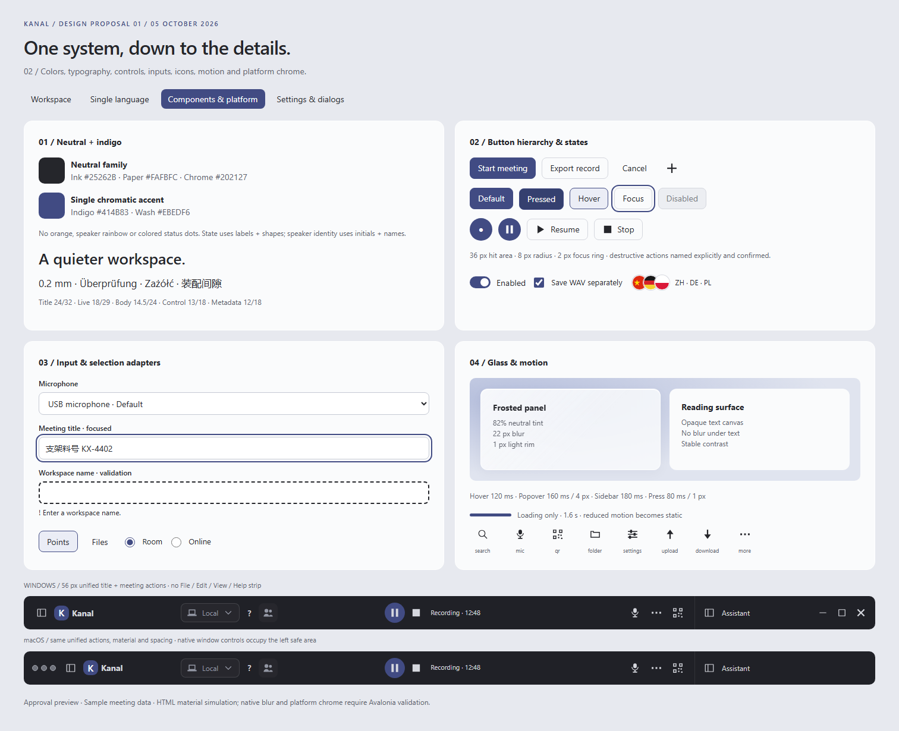
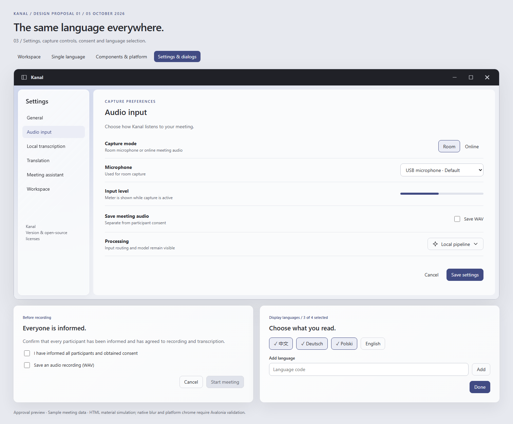
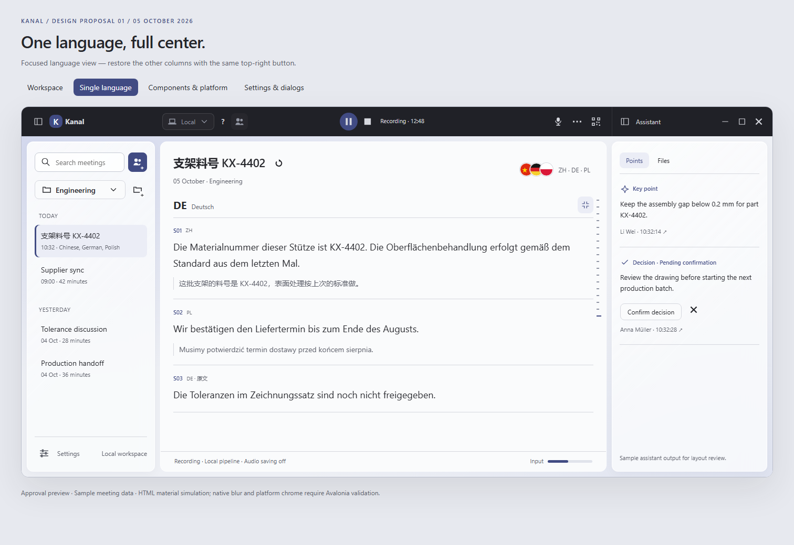

# Kanal UI proposal — Quiet glass

> Superseded: the user rejected this visual direction. Continue with the
> [Swiss-style proposal](swiss-ui-proposal.md) and its [current preview](../swiss-review/index.html).
> This document is retained only as design history.

2026-10-05 · `codex/new-ui` · **Awaiting user approval**

This document proposes the next visual system for the existing Kanal meeting workspace.
The user requested a design document with concrete images before implementation, a title bar
like their attached reference without File/Edit/View, consistent Mac and Windows presentation,
liquid glass panels, and fewer than three main colors. The reference is visual inspiration;
its displayed menu labels are not instructions.

No application code changes are included. This proposal becomes the visual baseline only after
approval. It would supersede the provisional warm-paper/indigo/orange palette and colored-speaker
rules in [Conversation K](../conversation-k.md), while retaining the layout and behavior in
[meeting workspace](../meeting-workspace.md). Keep the approved folded-K brand shape; recoloring
that asset to neutral/indigo is part of a later implementation, not a new logo design.

## Concrete visual review

Open [the local preview](liquid-glass-review/index.html) and use its three board links.
It works without a server or external dependencies. Hover, focus, press, editable fields,
checkboxes, radio buttons, and sample selected rows can be inspected. Other actions are visual
specimens; they do not record audio, save settings, change meetings, or operate the window.

### 1. Meeting workspace

The charcoal title bar follows the revised reference: no back/forward controls, with existing meeting actions moved into the topmost row.
Frosted side panels frame a solid reading canvas. Capture controls stay geometrically centered in the middle column, with balanced action zones
on either side and status next to transport. Points and Files match the visible tabs in the current code; Speakers stays hidden. No unimplemented Agent tab is added.
All meeting names, transcripts, timestamps and insights in the images are sample data.

### 2. Complete component and platform board

The board includes typography, palette, button hierarchy, interaction states, recording controls,
text inputs, validation, selectors, checkboxes, radio buttons, tabs, switches, icon specimens,
glass material, motion timings, and Windows/macOS title bar arrangements.

### 3. Settings and dialogs

Settings keep their vertical navigation. Labels explain the audio source and processing route.
Consent remains mandatory before each real start; audio saving remains an independent choice.
Language selection keeps its existing four-language limit.

## Color system: two families

Interpret “less than 3” as **two color families**, with shades and opacity variants derived from
them. It does not mean only two literal pixel values; text, borders and translucent materials
need a tonal range. There is one chromatic accent, indigo, and one achromatic neutral family.

| Token | Proposed value | Responsibility |
|---|---|---|
| Sheet | `#FAFBFC` | Opaque transcript and form reading surfaces |
| Paper | `#EEF0F5` | Shell backing, faint indigo-tinted neutral |
| Chrome | `#202127` | Title bar on both platforms |
| Ink | `#25262B` | Body, headings and control labels |
| Ink2 / Ink3 | `#60636D` | Secondary text and metadata; avoid lighter small text |
| Rule | `#D5D7DE` | Decorative separation; not sole interactive boundary |
| ControlRule | `#858997` | Native implementation target for unfilled control boundaries |
| Brand | `#414B83` | Primary actions, focus, selection, input meter |
| BrandHover / BrandPressed | `#35406F` / `#293359` | Filled control states |
| BrandWash | `#EBEDF6` | Selected rows, chips and tabs |
| OnBrand | `#FFFFFF` | Text on primary controls |

Remove orange accents from app chrome. Map existing Record/Hold/Alarm resources to the two-family
system rather than deleting their semantic responsibilities. Idle: record disc + “Start”; active:
pause glyph + “Recording”; paused: play glyph + “Paused”; ending: spinner + “Ending”. Stop stays a
square and an explicit accessible label. No state or speaker identity is encoded by color alone.
Use initials, full names and timestamps for people; ruler previews name each speaker, with the
active tick longer and heavier. Preserve folded tick grouping and keyboard navigation.

Retain the current language setting style as requested in the latest screenshots: overlapping
circular country flags plus `ZH · DE · PL` summary in the transcript heading, and the existing
language selection dialog. Do not replace them with plain code chips. Flags are a content-specific
exception to the two-family interface palette; neutral + indigo still governs controls and panels.
Keep native names, accessible labels, the four-language limit and running-time restrictions.
Native OS-owned caption colors are also outside the app palette. The macOS board uses neutral
placeholder circles for placement only.

Target 4.5:1 for text and 3:1 for focus/essential control boundaries. Verify on the composited glass
background, not merely against the nominal tint. Disabled elements remain visibly unavailable.
Errors use an icon, clear text and an outline; dangerous confirmation names the affected record.

## Title bar and platform consistency

Use one 56-DIP-high topmost row, aligned to the same left / center / right column boundaries
as the body. Remove back and forward controls entirely. This revision follows the user's second
reference and moves the existing middle meeting button bar into that top row.

Left: native macOS safe area where applicable, workspace collapse/expand, existing Kanal branding.
Center: three internal zones of equal left/right flexible width around an auto-sized transport
group. The start/pause/resume/stop group is geometrically centered within the transcript column.
Left zone contains processing mode, mode-help and capture profile; right zone contains microphone,
remaining existing actions and join QR. Drop the extra breadcrumb so it cannot displace transport. Right: assistant collapse/expand, assistant label, Windows caption buttons. Keep the
existing command and visibility bindings; no new navigation history or browser-like behavior.
Controls reserve their hit regions; remaining blank areas support window drag. The meeting title
and language selector remain in the transcript heading; the separate middle button-bar row goes away.

No in-window File/Edit/View/Help menu strip. Settings, About and licenses retain their existing
entry points; the OS-owned macOS menu bar is unchanged. Both platforms use the same meeting-action
order, type scale and material, with native caption location as the deliberate exception.

Double-click, drag, resize, maximize/restore, Windows snap interactions and
macOS full-screen behavior need native testing. Interactive hit regions never initiate window drag.

## Layout and surface materials

| Area | Dimensions and treatment |
|---|---|
| Main window | Existing 1320 × 820 DIP starting size; three columns remain |
| Unified top row | 56 DIP; column-aligned branding, existing meeting controls and caption controls |
| Left / right panels | Start 244 / 296 DIP; retain existing 180–480 DIP resize limits |
| Reading reserve | At least 320 DIP, subject to existing shell constraints |
| Panel gutter | 10 DIP; rounded panels at 12 DIP; splitters remain reachable |
| Meeting toolbar | Moved into top row; no second toolbar above transcript |
| Transcript | Opaque Sheet; 24–28 DIP inset; no backdrop texture behind text |
| Control / popover radius | 8 / 12 DIP; circular transport and initials stay circular |

Glass panel recipe: 82% Sheet tint over a restrained indigo/neutral backing, approximately 22-DIP
blur, subtle diagonal white highlight (maximum 10% opacity in native implementation), 1-DIP light
rim, and a low-opacity neutral shadow (0/6/20 DIP at about 4%). No animated refraction or moving
noise. The preview exaggerates the highlight slightly for comparison at screenshot size.

Menus and consent dialogs use a stronger 94–96% opaque tint. Text fields stay nearly opaque.
The transcript, selected text and code/part numbers never have a translucent background.
The preview is HTML/CSS glass simulation, not proof of Avalonia compositor parity. First test
in-app blur of the app's own backing on Windows and macOS; use the same opaque tint/rim/shadow
fallback wherever blur is unavailable, high contrast is enabled or reduced transparency is chosen.
Do not promise Acrylic/Mica and Vibrancy render identically. Reduced motion disables movement;
reduced transparency disables blur. Provide an application fallback setting if OS preference
integration is unavailable.

At narrow widths, retain centered transport, sidebar expansion controls, and access to all hidden
toolbar actions through an overflow menu. Collapse secondary panels before squeezing transcript
text. No horizontal toolbar scrolling or wrapping. Preserve the four sidebar-open combinations,
restore previous widths on reopening, and keep the ruler gutter present from an empty meeting.

## Typography

| Role | Size / line height, DIP | Weight |
|---|---|---|
| Meeting / settings title | 24 / 32 | 600 |
| Latest utterance | 18–19 / 29–30 | 400 |
| Transcript | 14.5 / 24 | 400 |
| Dialog / panel title | 16–19 / 24–28 | 600 |
| Buttons, inputs, menus | 13 / 18–20 | 400–600 |
| Metadata, helper text | 12 / 18 | 400 |

Use the same type scale and weights on both platforms. Prefer existing system-font strategy:
Segoe UI on Windows; Helvetica Neue/system sans on macOS; Microsoft YaHei/PingFang SC for CJK.
This preserves offline support. System font glyphs differ slightly across platforms; consistency
means equal hierarchy and spacing, not identical rasterization. Check Chinese, German umlauts,
Polish diacritics, `A-104`, `0.2 mm` and `±0.05 mm`. No all-caps body labels or excessive tracking.
Allow text scaling, localized labels and multiline helper text without shrinking control fonts.

## Controls, icons and input/view adapters

“Adapters” is interpreted as consistent presentation and interaction for each existing input type
and view, including keyboard, pointer and IME behavior; it does not introduce a new backend.

| Component | Style and interaction contract |
|---|---|
| Primary button | Indigo fill, white text, 36-DIP minimum hit target; one dominant action per region |
| Secondary button | Neutral fill, clear boundary; indigo wash on hover |
| Ghost / icon button | Transparent default, neutral glyph; bounded hover; same hit area |
| Destructive button | Explicit verb and object; neutral error icon; existing confirmation retained |
| Loading button | Spinner + verb; fixed width; disable duplicate submission |
| Recording transport | 38–40 DIP circular controls; stable positions, named states; cancel loading retained |
| Text / search input | 36–38 DIP height; persistent label except compact named search; clear focus ring |
| Title editor | Matches read-mode position; Enter commits, Esc cancels; respect IME composition |
| Select / model / microphone | Label + value + chevron; unavailable choices explain why; keyboard navigation |
| Online/room input adapter | Same selector geometry; device availability and routing clearly identified |
| Checkbox / radio / toggle | 17–18 DIP mark, 36-DIP row target; label clickable; checked uses indigo |
| Tabs / segmented choice | Indigo wash + heavier selected label; keyboard focus separate from selection |
| Language selector | Existing overlapping flags + code summary; current picker style, max four; running restrictions retained |
| Slider / input meter | Neutral track, indigo value; numeric/accessibility value; meter is not an input |
| Meeting / project row | Quiet default; selected indigo wash + leading bar; menu appears on hover and focus |
| Menus / tooltip / popover | 12-DIP radius, strong glass tint, 12-DIP inset; Escape dismisses and returns focus |
| Validation / error | Icon + specific message; associate with input; do not rely on color or a tooltip |
| Empty / loading / offline view | Same title/body/action hierarchy; truthful actionable state, no invented content |
| Transcript / assistant adapters | Shared type tokens; retain selectable text, source jumps and pending decision state |
| Ruler / scrollbars / splitters | Stable gutter; stronger latest tick; accessible previews; draggable splitters ≥6 DIP |

Reuse `Assets/Icons` and `Controls/Icons.cs`; audit all named assets for the same optical weight.
Proposed visual weight is equivalent to a 1.5–1.75-DIP stroke on an 18–20-DIP grid, round line ends.
Existing geometry loader uses fills: retain filled outline shapes or deliberately extend/test the
loader before introducing stroked SVGs. Available HTML specimens now directly reuse the repository SVG assets through CSS masks;
new shell-only glyphs remain illustrative. These are not changes to the native assets. No emoji, external icon-font dependency, mixed filled/stroked weights or platform-specific
button glyph sets. All icon-only controls require localized names, tooltips and keyboard access.

Apply these component rules to Settings, Languages, Consent, Import/Export, Delete meeting,
Changelog, Open source/About and Splash. Import/export uses down/up arrows respectively; title
regeneration uses the existing regeneration glyph. Audio saving must keep its true state visible.
Future features stay outside this visual implementation. Mobile is a later separate scope and
continues to obey its existing system light/dark behavior and byte-identical web/docs requirement.

## Motion

| Transition | Proposed timing | Rules |
|---|---|---|
| Hover / focus feedback | 120 ms ease-out | Color/opacity only; focus visible immediately |
| Press | 80 ms | At most 1 DIP down; no change to surrounding layout |
| Popover entry | 160 ms ease-out | Opacity + up to 4 DIP movement; instant interaction |
| Panel open / close | 180 ms ease-out | Width/opacity; no spring overshoot; remember width |
| Selected-row indicator | 120 ms | No large sweeping animation |
| Loading | 1.6 s subtle cycle | Only while busy; no recording-control pulse |
| Transcript arrival | None | No bounce, slide, typing effects, or disruptive scroll animation |

Reduced motion removes movement and loops, retaining immediate state changes. Auto-follow
transcript only while the reader is already at the live edge; preserve existing behavior otherwise.

## Implementation after approval

1. Centralize the approved tokens and control themes in `App.axaml`; adapt existing semantic
   resource keys. Recolor existing brand assets without changing the approved silhouette.
2. Add the unified title row in `MainWindow`; implement platform safe areas and caption hit testing.
   Reuse existing toolbar commands and preserve the meeting lifecycle and shell constraints; no back/forward controls.
3. Apply surfaces and consistent controls to WorkspaceSidebar, IconBar, MeetingRoom and SidePanel;
   retain native bindings and command availability. Integrate the material fallback first.
4. Apply the same input/dialog system throughout secondary windows. Preserve consent, language
   limits, pauses, import safety, read-only record browsing and non-destructive speaker merges.
5. Test behavioral changes in the existing headless UI tests; build on .NET 10. Visually review
   real Windows and macOS windows at 100/125/150/200% scale, long names and CJK composition.

Acceptance: all four panel-open combinations; resize and narrow window; keyboard-only operation;
visible focus and text selection; high contrast and reduced motion/transparency; consent before
every real start; no audio during pause; recording/loading/end/failure states; menus and input
validation; 1–4 language columns; ruler source navigation; all secondary dialogs; native caption
and full-screen behavior. Screenshot review does not substitute for these native checks.

## Revision grounded in the current worktree

The 2026-10-05 follow-up requests a reference-like, column-aligned top row, no back/forward,
and the center button bar at the window top. It also explicitly requests combining existing code
functionality and existing design. This is a layout proposal over the current code, not a separate
product concept. The historical workspace spec remains the interaction baseline; the requested
unified top row replaces its old 76-DIP per-column header arrangement after approval.

| Current implementation | Proposal mapping / behavior retained |
|---|---|
| `MainWindow.axaml` | Move top chrome out of center DockPanel; bind top and body column widths to the same shell; retain both GridSplitters |
| `WorkspaceShellViewModel` / `SidebarViewModel` | Current header starts at 76 DIP, both sidebars default 272 DIP, range 180–480, center reserve 320; 56-DIP top row is proposed, not already implemented |
| `WorkspaceSidebarView` | Keep search, new meeting, workspace picker/add menu, import record/bundle, row rename/generate/export/delete, settings and workspace errors |
| `IconBarView` | Reposition Modes + mode-help, CaptureProfiles, Start/Pause/Stop, AudioDevices and JoinQr; retain all bindings and availability rules |
| `AudioDevices` flyout | Preserve microphone/device choice, computer output when required, save-audio choice and running-state restrictions; it is more than a microphone icon |
| Capture guidance | Preserve guidance/unavailable explanation and dismissal; use an anchored flyout/note outside the draggable area |
| `StatusBarView` | Preserve Status, recording path/state and ShowMicLevel/MicLevel; compact footer specimen now included |
| `MeetingRoomView` | Keep title rename/regenerate/read-only rules, locked language selection during recording, transcript and ruler preview/source jumps |
| `SidePanelView` | Visible Points and Files; SpeakersTab currently IsVisible=False, so do not expose it in the production refresh |
| Points | Preserve analyst unavailable/empty states, source links, candidate-only ConfirmCommand and DismissCommand |
| Files | Preserve file tree, empty/error states, import and existing item commands; no invented agent chat |
| Existing dialogs | Theme the actual settings, consent, languages, import/export, delete, changelog and licenses views using shared tokens |

The workspace image depicts an active meeting: processing/capture/language choices are locked,
pause/stop and appropriate input controls remain available. Meeting content and assistant insight
text are sample data illustrating their existing views; they do not imply successful model output
without a configured analyst. Preview choice of 244/296-DIP sidebars is a visual sample, not a silent
change to the current 272/272 defaults. Keep current defaults initially and let existing resizing
produce the pictured proportions. The simple K tile is a layout placeholder; reuse the approved
folded-K asset in implementation.

The Files tab in the HTML switches to an empty/file-import specimen; real file-tree rendering remains the native view.
The mode-help control and exact microphone/WAV options must retain native flyout contents even when
compressed in a screenshot. The preview is explicitly not a substitute for those working controls.

## Latest revision: current UI screenshots

The latest user screenshots define the content baseline: one column per selected language,
original/translation hierarchy, original-language inset blocks, existing flag selector, and the
current left-side search/project layout. The earlier stacked-language preview is replaced by this
actual column structure. See also [focused-language preview](liquid-glass-review/index.html?board=focused).

- **Centered transport:** internal top-row layout is `*, Auto, *` inside the middle shell column.
  Transport occupies Auto and remains centered regardless of the number/width of side actions.
  Left side holds processing mode/help/capture; right side holds input and join actions. When width
  is tight, secondary actions move to overflow; they never push transport away from the center.
  Center refers to the transcript region, not the entire window including unequal sidebars.
- **Per-language focus:** each column has a 30–36-DIP accessible expand button at the header's top
  right. Clicking shows just that language across the middle region; it does not enter OS full
  screen or hide sidebars. The same location becomes Restore columns. Keep the selected languages,
  meeting, toolbar, title, language selector and ruler unchanged. Do not restart recording, request
  new translation, or change display-language settings. Switching view only changes projection.
  Preserve each column's reader position and live-follow state through expand/restore. Existing
  `ShownColumns`/language-column rendering is the seam to adapt; focus mode is a newly requested
  presentation feature, not already implemented. In native code it needs meaningful headless
  state tests (focus/restore, changed language set and meeting switch), followed by visual checks.
- **Language controls:** retain existing overlapping flags and code summary and current picker
  interaction. Country-flag content colors are the user's explicit exception to the UI palette.
- **Distinct add controls:** new meeting uses a meeting/people glyph with plus badge and primary
  indigo button; new project uses a folder with plus badge as a neutral button. Keep the existing
  project-add menu including record/bundle import, with the New project entry explicitly named.
  Names/tooltips remain Add meeting and Add project; keyboard operation cannot depend on the icon.

The preview supports expanding/restoring each language via the header button; the Single language
board opens German focused initially. All screenshot content is illustrative. Production application
sources remain unchanged pending approval of this revised design.

## Approval requested

Approve or revise this single coordinated direction: **charcoal reference-style top bar,
neutral + indigo palette, restrained glass panels, opaque transcript, system fonts, and the
component rules shown above**. Language settings retain their current circular flags and code summary; flags are a content
exception to the interface palette. Speaker name/initial styling remains a proposal for approval. No application UI
implementation begins until the user confirms the proposal.

## Preview verification

The three images are deterministic renders of the included HTML preview. Native application
code has not changed, so no .NET behavior or rendering claim is made. Native platform blur,
caption integration and font metrics remain implementation validation work.
