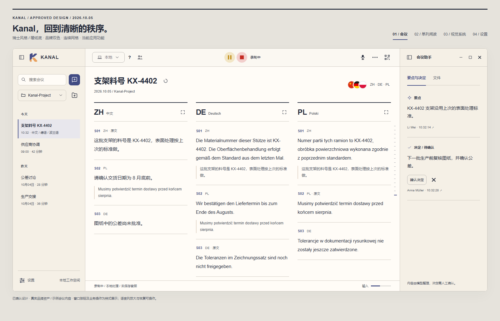
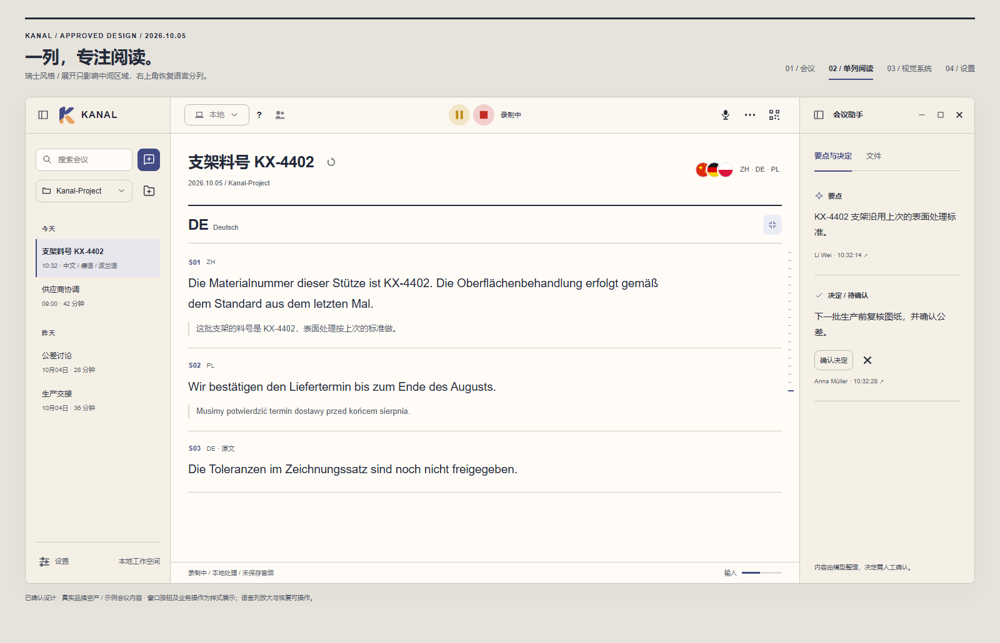
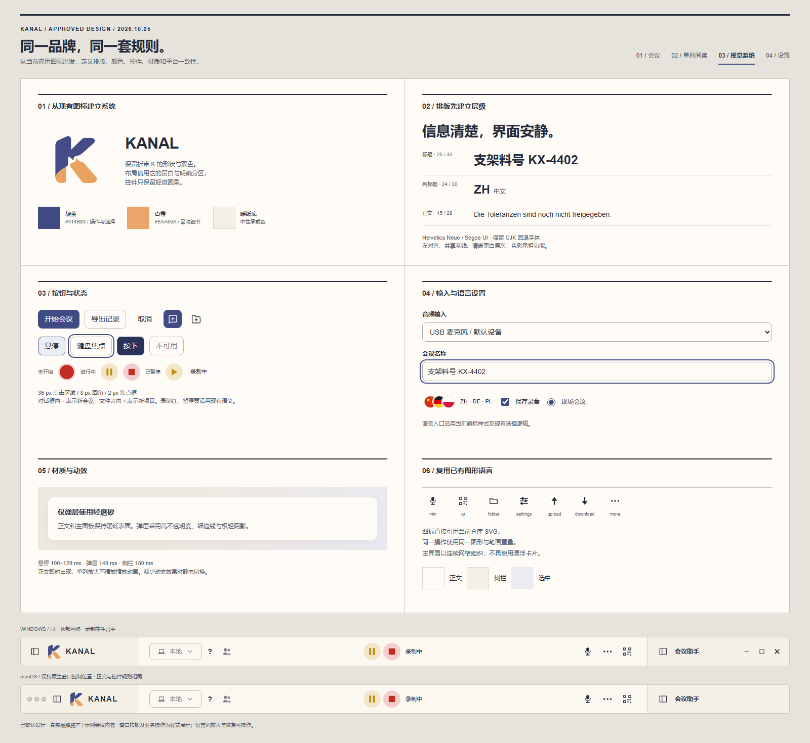
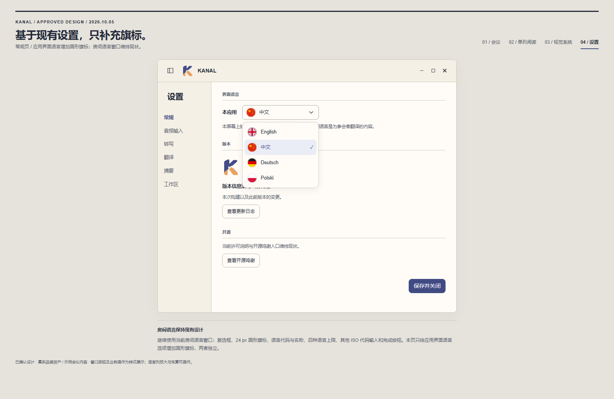

# Kanal · 当前 UI 设计规范

2026-10-05 / `codex/new-ui` / **用户已确认 · 当前设计基线**

本规范是桌面 UI 的最新设计依据，包含本轮全部已确认修改。发生冲突时，本文优先于
Conversation K 的旧视觉参数、meeting-workspace 的旧顶栏尺寸与历史原型，以及液态玻璃旧方案。
Conversation K 继续提供品牌资产生成规则；meeting-workspace 继续约束本文未调整的业务交互。

对应预览：[当前 UI 预览](swiss-review/index.html)。原生 Avalonia 实现已完成并记录在
[implementation-review](implementation-review/README.md)；该记录列出实际验证的平台与剩余限制，
设计确认不表示 macOS 与其他缩放档位已验证。

## 视觉依据：真实品牌资产

已查看当前应用实际使用的 `src/Kanal.Host/Assets/kanal-splash-mark.png`，并读取
[Conversation K](conversation-k.md) 与图标打包脚本。图标是靛蓝、杏橙的折带 K，
结合双向对话的留白，轮廓有适度圆角。预览直接引用这一资产，不再使用字母 K 占位块。
不重画、不重新配色、不改变图标的轮廓。

这版用以下方式使 UI 与图标契合：

- 靛蓝用于普通主操作、选中、焦点和进度；杏橙保留在品牌中。录制红、暂停黄沿用现有独立语义资源。
- 恢复现有品牌文档的暖纸色正文与侧栏，文字保持深色。
- 用共享网格、明确留白、左对齐、字号与字重建立层级。
- 三栏构成连续工作空间；取消大圆角漂浮面板、重阴影和整窗蓝灰玻璃底。
- 图标的柔和轮廓保留在小控件圆角中；不把折带造型重复装饰到正文。

这是针对 Kanal 的瑞士风格界面规范：强调信息结构与排版，不把应用改成海报。

## 已确认设计与预览

[打开交互预览](swiss-review/index.html)。顶部四个入口分别展示会议、单列阅读、视觉系统、现有常规设置页。
放大/恢复语言列、编辑示例输入、切换要点/文件、复选框与焦点状态可操作；业务按钮不执行真实操作。

### 会议工作空间

### 单语言占满中栏

### 品牌与组件系统

### 常规设置与应用界面语言

## 颜色与材质

界面使用 **两种品牌色**，配合中性色与明度变化。与最初“尽量少于三种颜色”的诉求相符，
不为每种功能再增加新的装饰色。旗标继续使用自身颜色，这是用户明确保留的内容表现。
系统原生窗口控制也保留平台规定。当前录制/暂停/错误语义色保留，不受装饰色数量限制。

| 资源 | 色值 | 用途 |
|---|---|---|
| Brand | `#414B83` | 主按钮、选中标记、键盘焦点、输入电平 |
| BrandAccent | `#EAA66A` | 现有图标；不用作小字文字 |
| Sheet | `#FFFCF7` | 正文、表单 |
| Paper | `#F5F0E6` | 侧栏与顶部承载面 |
| Ink | `#252B3B` | 标题、正文与图标 |
| Ink2 | `#535969` | 次级文字 |
| Record / RecordWash | `#C42B22` / `#F2CFCC` | 录制圆点、结束方块及浅红圆底 |
| Hold / HoldWash | `#C08A12` / `#F2E6C6` | 暂停/继续及浅黄圆底 |
| Rule | `#CEC9C0` | 内容分隔；不独立承担控件可识别性 |
| BrandWash | `#EBEDF6` | 选中行、轻量反馈 |

主界面是稳定的暖纸面。此前要求的液态玻璃质感仅保留在菜单、设备选择等弹层：
约 94% 不透明度、16 DIP 轻磨砂、1 DIP 细边线和极轻阴影；现有弹层圆角 12 DIP。正文不透出背景纹理。
原生模糊不可用、降低透明度或高对比模式下使用实色表面。
HTML 磨砂是视觉模拟，原生 Avalonia 的平台材质仍需实施时验证。

## 网格与顶部布局

顶部合并为一条 58 DIP 操作区，与下方三栏共用列边界。没有前进/后退，也没有 File/Edit/View 菜单行。
浅暖顶部延续品牌底色，避免上一版深色带把界面截成两块。

| 区域 | 结构 |
|---|---|
| 左顶栏 | 侧栏控制、真实图标、KANAL 字标；macOS 预留原生窗口控制位置 |
| 中顶栏 | `*, Auto, *` 三段布局：左侧模式/帮助/收音；中央录制控件组；右侧设备/更多/二维码 |
| 右顶栏 | 会议助手、收起控制；Windows 窗口按钮靠右 |
| 左侧栏 | 搜索＋添加会议；项目选择＋项目添加菜单；会议记录；底部设置 |
| 正文标题 | 会议名、重命名/重新生成入口与现有语言设置 |
| 正文内容 | 每种语言一列，列标题与右上角放大按钮，原文/译文层级 |
| 右侧栏 | 现有“要点与决定 / 文件”，与当前代码可见页签对应 |

录制控件组以**中间正文区域**的几何中心定位。左右操作多少和长度不同，也不能把它挤偏。
窗口收窄时，中央录制控件不缩小、不裁切；其左右各保留 20 DIP 安全间距，外侧再留 12–22 DIP。
左右操作区等宽收缩并各自裁切：左侧固定左端、裁掉靠中间的右端；右侧固定右端、裁掉靠中间的左端。
按钮不压缩、不换行、不溢出进入中央保护区；此规则取代之前的自动收入更多菜单方案。
中栏内容宽度不超过 460 DIP 时隐藏紧邻录制控件的状态文字，底部状态仍保留。
保留既有最小窗口宽度与两侧展开入口；裁切区随窗口重新拉宽恢复。
标题栏拖动区域与按钮命中区域分离。Windows/macOS 共用布局与样式，原生窗口控制位置按平台保留。

预览为了展示阅读宽度使用左 232、右 280 DIP；原生默认仍从当前左右 272 DIP 起步。
保留 180–480 DIP 调宽范围、320 DIP 中栏保留宽度和四种侧栏展开组合。
主面板无间隙、无独立圆角卡片。内容使用 28 DIP 边距，语言列间距约 27 DIP。
列标题上方 2 DIP 深色线建立分区，其余内容分隔为 1 DIP 浅线。

## 排版

| 角色 | 大小 / 行高 | 字重 |
|---|---|---|
| 会议标题 | 25 / 32 DIP | 600 |
| 语言代码 ZH / DE / PL | 24 / 30 DIP | 700 |
| 转写正文 | 15 / 28 DIP | 400 |
| 单列专注正文 | 19 / 33 DIP | 400 |
| 原文引用 | 12–13 / 21–23 DIP | 400 |
| 按钮、输入、页签 | 12–13 / 18 DIP | 400–600 |
| 时间、来源等次级文字 | 11–12 / 17 DIP | 400 |

保留当前系统字体策略：Helvetica Neue / Segoe UI 加 Microsoft YaHei / PingFang SC 回退。
保持相同层级和行距，接受平台字体细微字形差异。完整支持中德波文本、零件编号、公差符号。
不在中文上使用人为大字距；长标签不压缩字体，正文不居中排版。
紧凑预览中部分元数据为 10–11 px；正式实现以系统缩放与真实阅读效果校准，优先 12 DIP。

## 控件与交互规范

| 控件 | 设计与保留行为 |
|---|---|
| 主按钮 | 靛蓝填充；每个操作区域一个主动作；36 DIP 点击区域 |
| 次按钮 | 浅底细边线；8 DIP 圆角；与主按钮同高 |
| 图标按钮 | 静态透明，悬停有边界；现有 SVG 资产优先，保留可访问名称 |
| 录制控制 | 沿用 34 DIP 圆底：红色录制圆点、黄色暂停/继续、浅红圆底内红色结束方块；保留加载取消与状态可见性 |
| 项目添加 | 细线文件夹，内部居中加号；中性按钮；保留原有项目创建与会议导入（`.kl`）菜单 |
| 会议添加 | 细线对话框，内部居中加号；靛蓝主按钮；直接对应现有 NewMeetingCommand |
| 选择与输入 | 保持标签、当前值、下拉箭头；选中/不可用/错误均有明确反馈 |
| 搜索 | 与添加会议同一基线；完整 8 DIP 圆角矩形边框、暖纸底，聚焦时整圈靛蓝描边；键盘可达 |
| 复选框与单选框 | 原生语义与状态，靛蓝选中，标签可点击 |
| 页签 | 字重＋细下划线，不使用胶囊卡片；当前只开放已有页签 |
| 会议列表 | 相同栅格；选中浅靛底＋左侧细标记；保留菜单入口和只读规则 |
| 语言设置 | 当前重叠圆形旗标＋ZH · DE · PL，保留语言弹窗、上限四种与录制中限制 |
| 决定操作行 | 确认与忽略同一 flex 行，32 DIP 等高、垂直居中、7 DIP 间距 |
| 错误与危险操作 | 明确图标和文字；保留现有确认，不能只靠颜色传达 |

两个添加图标重新绘制为独立 SVG：24×24 网格、1.6 单位线宽、21 DIP 显示、36 DIP 点击区域。
加号融入主体留白，不使用角落徽标叠加。对话框呼应品牌的双向对话含义，文件夹对应项目容器。
资产位于 `swiss-review/icons/`；原生实施时按当前几何加载器要求转换为填充轮廓。

普通控件维持当前 **8 DIP** 圆角，弹层维持 **12 DIP**。字体回退与品牌资产均维持当前资源。
发言人色、录制色、暂停色、错误色是现有独立语义资源，不按装饰色限制删除或重映射。

### 本轮与现有实现逐项核对

核对依据是用户提供的当前应用截图，以及工作树中的 `App.axaml`、`IconBarView.axaml`、
`LanguagesWindow.axaml`、`SettingsWindow.axaml`、`ConsentWindow.axaml`、`FlagIcon.cs`、
`LanguageCatalog.cs`、`Localizer.cs` 和中文本地化资源。没有声称已经运行或验证原生窗口。

| 设计元素 | 当前实现 | 本轮处理 |
|---|---|---|
| 录制圆点 | 34 DIP 浅红圆底、28 DIP 红圆点 | 恢复原样 |
| 暂停/继续 | 34 DIP 浅黄圆底、18 DIP 黄图形 | 恢复原样 |
| 结束 | 34 DIP 浅红圆底、18 DIP 红方块 | 恢复原样，不再用黑色裸方块 |
| 悬停 | 140 ms CubicEaseOut，放大 1.1 倍，不变色 | 与现有规则一致；减少动态效果时关闭缩放 |
| 加载状态 | 结束按钮叠加旋转弧线，允许取消加载 | 原生实施继续复用，不替换为新按钮 |
| 房间语言 | 400 DIP 窗口、43 DIP 复选行、24 DIP 旗标、代码/名称、其他 ISO 输入、最多四种 | 原样保留；删除此前自创的胶囊选项弹窗 |
| 应用语言 | 设置→常规→本应用，200 DIP ComboBox；English、中文、Deutsch、Polski | 仅在选中值与下拉选项前增加现有 FlagIcon 风格的圆形旗标 |
| 常规设置 | 界面语言、版本、更新日志、开源鸣谢、保存并关闭 | 按当前结构重建预览；不新增“取消”或改变保存语义 |
| 音频设置 | 麦克风选择、测试/停止、实时与峰值电平、判断与处理说明 | 原样维持；删除上一版自创的设置字段布局 |
| 知情确认 | 保存音频、知情确认、远程提醒与现有说明 | 保留当前窗口；不另行设计预览中的替代弹窗 |
| 搜索/项目/会议列表 | 当前命令、添加菜单、重命名和记录操作 | 保留；仅已授权的两个添加图标采用新 SVG |
| 语言列 | 当前内容、原文与译文关系、刻度尺 | 只添加用户要求的放大/恢复呈现状态 |

应用语言只控制本屏幕标签与提示；房间语言控制会议转写/翻译列和手机端语言，互不替代。
应用语言旗标按已有 `FlagIcon` 的 `en/zh/de/pl` 映射，始终搭配原生语言名称，不能只显示国旗。
预览旗标 SVG 按现有向量绘制规则生成，正式实现复用 `FlagIcon`，不新增另一套资产。

### 每列放大

列标题右上角固定放大按钮。点击后只让该语言占满中间正文区域；顶栏、两侧面板和语言设置保留。
同一按钮变为恢复，恢复后显示原来的语言集合。选中的语言、录制状态、翻译任务、滚动位置和
跟随实时文本状态不能因切换布局而丢失。无需请求新的转写/翻译。

这是新增加的呈现状态，原生实施时应基于 `ShownColumns` 做视图投影，测试放大/恢复、
切换会议和语言集合变更。原生实现为 `MainViewModel.FocusedLanguage` 与每列 `IsShown/IsFocused/CanFocus`，已有行为测试。

## 动效

普通控件悬停 100–120 ms，弹层淡入 140 ms，侧栏开关 180 ms。录制控件遵循当前 140 ms / 1.1 倍缩放规则。无需弹簧或夸张位移。
文字即时出现，不逐字打字、不闪烁录制按钮。语言放大/恢复直接切换，避免文本缩放导致阅读跳动。
减少动态效果时采用静态状态变化；加载反馈同时有文字。

## 与现有代码的对应

| 现有模块 | 实施落点 |
|---|---|
| `App.axaml` | 统一纸色、靛蓝、杏橙、文字、线条、尺寸与控件状态资源 |
| `MainWindow.axaml` | 顶部提升到三栏之上并共享列宽；保留分隔条与宽度约束 |
| `IconBarView.axaml` | 复用模式、帮助、收音、Start/Pause/Stop、设备和二维码绑定；仅重排 |
| `WorkspaceSidebarView.axaml` | 使用真实品牌资产，区分两种添加图形，保留现有菜单 |
| `MeetingRoomView.axaml` | 保留语言列及语言选择器，添加单列呈现状态与恢复入口 |
| `StatusBarView.axaml` | 保留 Status、录音路径/状态和输入电平 |
| `SidePanelView.axaml` | 保留分析器空状态、候选确认/忽略、来源、文件树及导入；不开放隐藏 SpeakersTab |
| 各设置/确认窗口 | 相同排版、按钮、输入与磨砂弹层规范；保留各自业务限制 |

真实录制前知情同意、暂停停止送音频、独立保存 WAV、模型可用性、导入安全以及
非破坏性发言人合并等约束继续适用。没有因视觉稿而增加代理聊天或其他未实现功能。
移动端不在本次桌面设计实施范围内。

## 确认状态与实施验收

用户已确认：**真实图标的靛蓝/杏橙、暖纸底、连续三栏网格、强化排版和轻量控件**这一套方向。
之前已明确的录制居中、语言列放大、语言设置样式与添加图标区分均已纳入。

预览用本地 HTML/CSS、仓库图标和示例文本，无外部字体或依赖。截图是已确认设计的参考。
原生实现已在 Windows 11（125% 缩放）运行并截图，新呈现状态有行为测试；macOS、100/150/200%
缩放、中文输入法、高对比度仍待验证，见 implementation-review。
